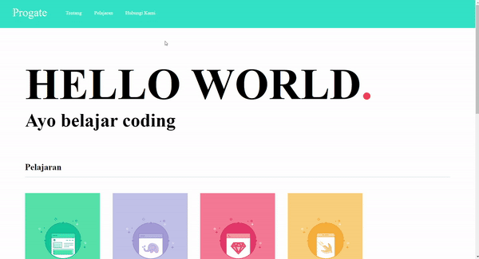
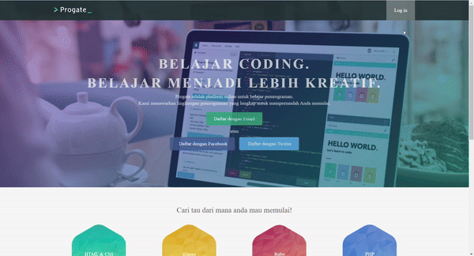
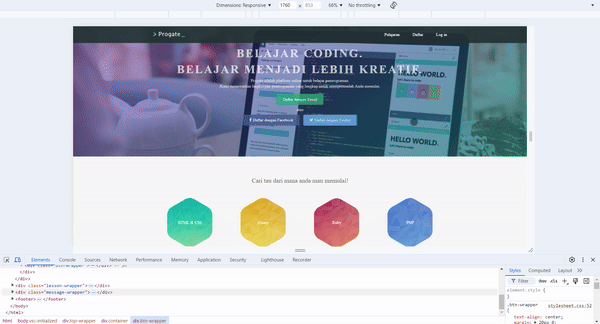

# HTML & CSS Progate

### Hello my name is keindra and this is my documentation about my learning journey in progate

## Overview
This repository is a documentation of my learning progress at Progate's HTML & CSS Bootcamp. The purpose of this repository is to track my learning journey and serve as a reference for future web development projects. Throughout this bootcamp, I learned how to create responsive websites using HTML and CSS, and I applied various concepts such as layout design, styling, and media queries. Below is a summary of the key topics I covered.

## Topics Covered

### 1. **Getting Started with HTML**
- Basic structure of an HTML document.
- Creating titles and paragraphs.
- Adding hyperlinks and images to web pages.
- Working with lists (ordered and unordered).

### 2. **Getting Started with CSS**
- Applying colors to text and backgrounds.
- Adjusting font size and font families.
- Setting widths, heights, and background colors for elements.
- Using CSS classes to style specific elements.

### 3. **Layout Basics**
- Structuring HTML documents.
- Working with layout elements such as headers, footers, and main content.
- Using padding, margins, and borders to control spacing around elements.
- Creating forms and designing their layout.

### 4. **Advanced Layout Techniques**
- Creating responsive designs that adjust to different screen sizes.
- Implementing media queries for tablet and smartphone views.
- Using `box-sizing` and `max-width` properties to create flexible layouts.

### 5. **Flexbox for Responsive Design**
- Applying the `display: flex` property to create flexible layouts.
- Using `flex: auto`, `flex-wrap: wrap`, and `flex-direction` to control layout behavior.
- Combining Flexbox with media queries for optimal responsiveness across devices.

## Demo
Below are GIF demos of the websites I built during the bootcamp:

- **Demo 1**: A simple website built using basic HTML & CSS.
  

- **Demo 2**: A more advanced website with improved layout and styling.
  

- **Demo 3**: The second website with fully responsive design applied.
  

## Summary of Skills Acquired
Throughout the progate bootcamp, I gained a comprehensive understanding of the following concepts:
- Semantic HTML structure and how to organize content effectively.
- Styling with CSS, including typography, spacing, and visual hierarchy.
- Creating layouts with both traditional CSS and Flexbox.
- Designing responsive websites using media queries and flexible units.

This repository serves as a testament to my progress and skills in web development, and I hope it can inspire others who are starting their learning journey.
